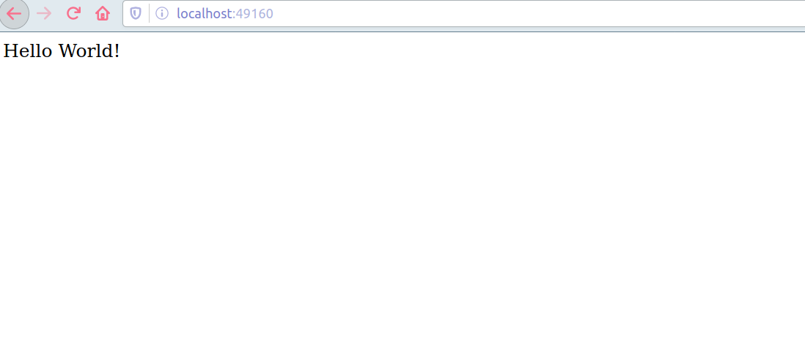

# Basic Express app in a docker container

### Step 1: Install Docker
install docker on your host machine

### Step 2: Build the image 
`docker build -t express-app .`

### Step 3: Run the image
`docker run -p 49160:3000 express-app`

### Step 4: go to localhost:49160
